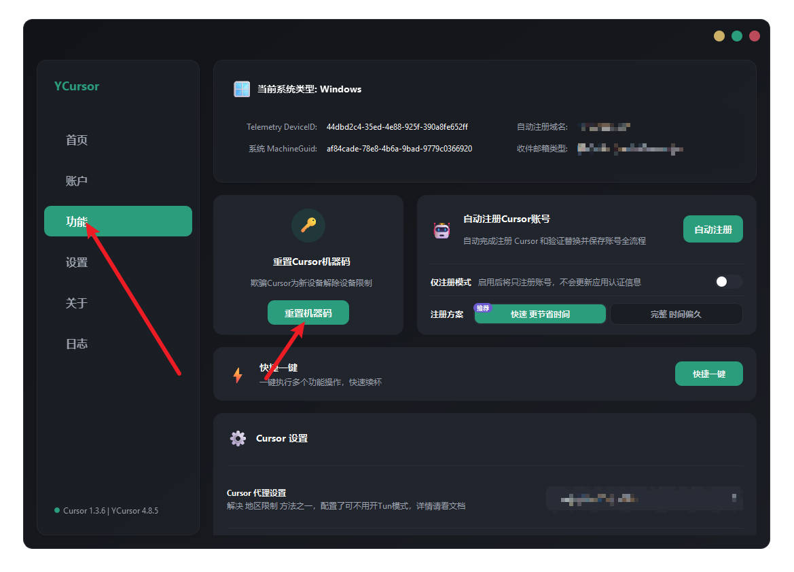

# YCursor 🚀

## 🌟 重要提示

🎉 **win和mac已经发布啦！**

**详情请看 Ycursor 文档 [点我](https://docs.qq.com/aio/DV2VKUnNaeFRyRGRH?p=DKRZhtXI98ELAa724va8q8)** 👈

🔄 续杯流程：重置机器码 + [自动注册](https://docs.qq.com/aio/DV2VKUnNaeFRyRGRH?electronTabTitle=欢迎使用YCursor&isOfflineNewFileFlag=true&p=TMZFTjie4rZzPpOoMpORwZ&client_hint=0)

**🎉 工具完全免费！**

全网第一个免费auto工具，完美解决自动更换账户后打开Cursor账户自动退出问题。

解决绑卡问题，完美无限白嫖续杯Cursor试用账号，可用Claude 4！

------

##  续杯教程

> 前言：
>
> 1. 📝 目前注册账号因为Cursor的政策修改，不绑卡无法获取试用。教程里是绑定支付宝，因为支付宝人人都有而且也比较方便。但放心，不会产生任何扣费，并且注册完支付宝就可以直接解绑续费免密支付了。如果你介意这个，也可以不用看了，因为普通号真的没什么用。
> 2. 🤔 既然选择白嫖，那么请您带上🧠进行白嫖。遇到问题学会看文档、搜索文档、网络搜索解决问题。而不是有问题上来就是一个毫无用处的图片，要么就是一句话“为什么”。文档实在是找不到，就按照 `帮助` 文档里的 `正确提问` 来问问题，不然我真的懒得理，甚至看见这种多了真的想骂人**💢**。

------

### 💾 1. 工具下载

👉 **[开始安装YCursor](https://docs.qq.com/aio/DV2VKUnNaeFRyRGRH?electronTabTitle=欢迎使用YCursor&isOfflineNewFileFlag=true&p=dzwEhos3nJgQtmBcAc9QAC&client_hint=0)**

 Win下载.msi安装即可

Mac除了下载.dmg，还需要下载Y系列启动器一起，安装完后运行以下命令：

```bash
xattr -cr /Applications/YCursor.app
xattr -cr /Applications/Y系列启动器.app
```

------

### 🚀 2. 启动YCursor

Win直接双击运行

Mac打开 Y系列启动器，启动软件选择YCursor，然后输入你本机密码，密码正确就会帮你启动YCursor。

------

### 🛠️ 3. 配置 自动注册配置

在设置页面配置 自动注册配置，配置说明可以点击右上角的`帮助`按钮进行查看。


------

### 🔄 4. 重置机器码

⚠️ **重置机器码前，你先看一遍** **[续杯一套流程](https://docs.qq.com/aio/DV2VKUnNaeFRyRGRH?electronTabTitle=欢迎使用YCursor&isOfflineNewFileFlag=true&p=XLdQ3OvGxyho4uxjCDiAyI&client_hint=0&client_hint=0)** 里的检查，确保一切正常，再点击重置机器码。

功能页面 -> 重置机器码


------

### 📝 5. 注册Cursor试用号

按照 **[试用账号注册教程](https://docs.qq.com/aio/DV2VKUnNaeFRyRGRH?electronTabTitle=欢迎使用YCursor&isOfflineNewFileFlag=true&p=TMZFTjie4rZzPpOoMpORwZ&client_hint=0&client_hint=0)** 进行注册Cursor试用号。

------

## 🎉 完事！

按照上面的步骤，后续续杯只需要快捷一键里选择 重置机器码 + 自动注册 就好了，或者你可以先开仅注册屯一些号，那么下次只需要切换账号就行了，很简单，续杯流程（重置机器码 + 自动注册）基本上60秒左右就完事，没有其他麻烦多余的步骤。

> 📅 以上续杯步骤更新于2025/08/01，具体和新的续杯流程请看文档 **[续杯一套流程](https://docs.qq.com/aio/DV2VKUnNaeFRyRGRH?electronTabTitle=欢迎使用YCursor&isOfflineNewFileFlag=true&p=XLdQ3OvGxyho4uxjCDiAyI&client_hint=0&client_hint=0)*
